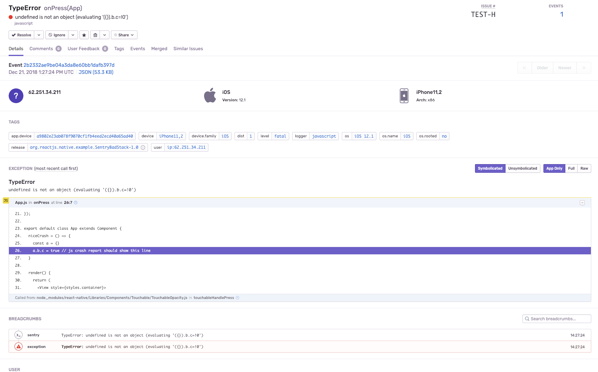
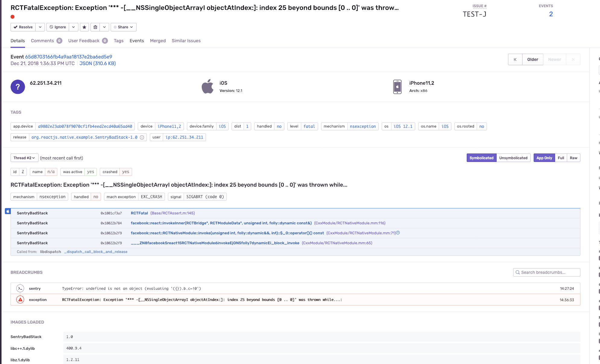

# steps I took to setup this repo:
- `react-native init SentryBadStack`
- `cd SentryBadStack`
- commit
- `yarn add react-native-sentry`
- `react-native link`
- commit
- create release xcode scheme
- commit
- add js crash
- commit
- add sourcing of .zshrc to get the $PATH
- commit
- add native crash
- commit
- readme updates

# reproduce:
- `yarn install`
- `open ios/SentryBadStack.xcodeproj`
- switch to `SentryBadStack Release` scheme
- `yarn start`
- press play on xcode
- tap `CRASH JS` button
- see everything is nice

- tap `CRASH NATIVE` button
- see that the stacktrace looks weird, no formatting

